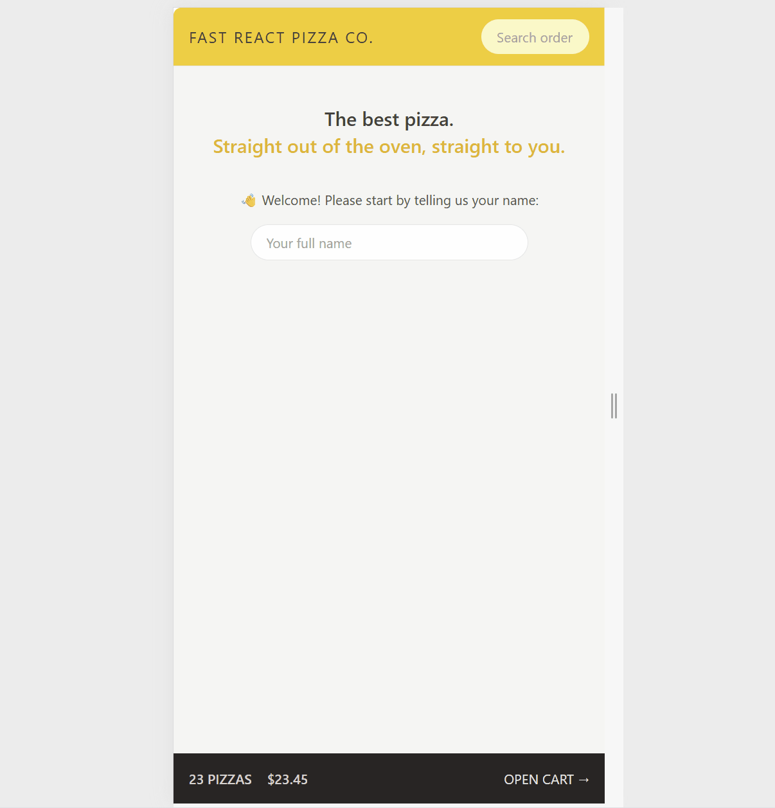

# 🎮 Fast React Pizza – React + Vite + Tailwind

A Pizza ordering webapp made for a mock client while learning **React Router** and **CSS Tailwind**.

---

## 👀 Preview


---

## 🧠 What I Learned
- How to use modern **React Router**
- Fetching data from a backend server
- Creating a **responsive layout** with **TailwindCSS**

---

## ⚙️ Tech Stack
- ⚛️ **React** – component-based UI
- ⚡ **Vite** – lightweight dev environment
- 💅 **TailwindCSS** – fast, modern styling

---

## 🧩 Features
- Fetches data from backend server
- Search exisisting orders
- Create new orders and add to cart
- Fully responsive (desktop and mobile friendly)  

## 🚀 Getting Started

### Clone the Repository
```bash
git clone https://github.com/luther0929/fast-react-pizza.git
cd fast-react-pizza
npm install
npm run dev
```
